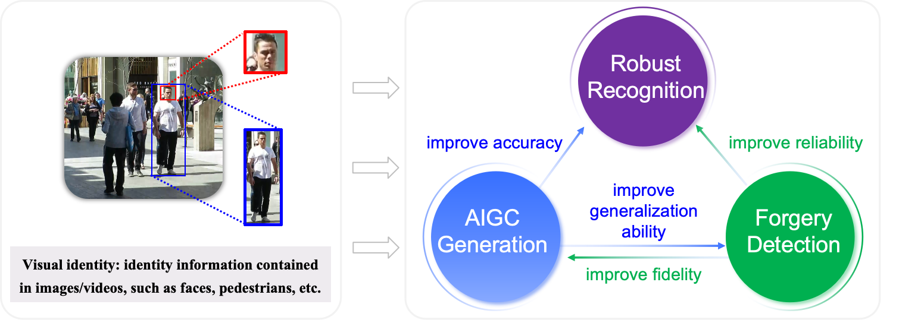

  

 
Our research focuses on **Trustworthy Visual Identity Recognition** in multimedia analysis and security:

- **AIGC Generation** focuses on face photo-sketch synthesis, face anonymization;
- **Forgery Detection** focuses on Deepfake detection, face anti-spoofing;
- **Robust Recognition** focuses on face recognition, person re-identification, adversarial attack and defense.

***
Grants (in Chinese):
- 国家自然科学基金面上项目，主持，2023-2026;
- 中国科协青年人才托举工程，主持，2022-2024;
- 国家自然科学基金联合基金重点项目，课题负责人（2/32），2023-2026;
- 国家自然科学基金重点项目，核心成员 (2/10)，2021-2025;
- 国家重点研发计划专项预研课题，核心成员 (3/21)，2019-2022.
- 陕西省重点研发计划项目，主持，2023-2024;
- 西电基础研究跃升计划，主持，2023-2025;
- CCF-腾讯犀牛鸟基金，主持，2022-2023;
- 人工智能教育部重点实验室开放课题，主持，2024-2025;
- 国家自然科学基金青年项目，主持，2019-2021;
