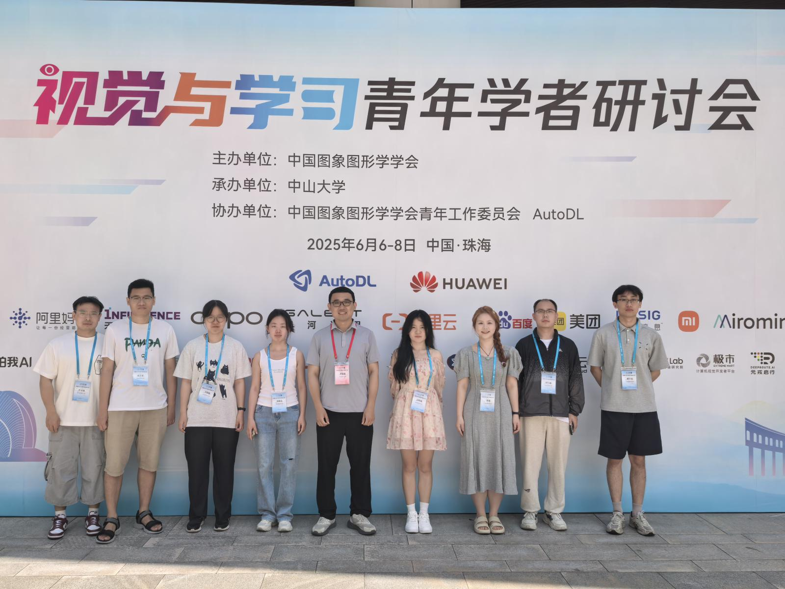
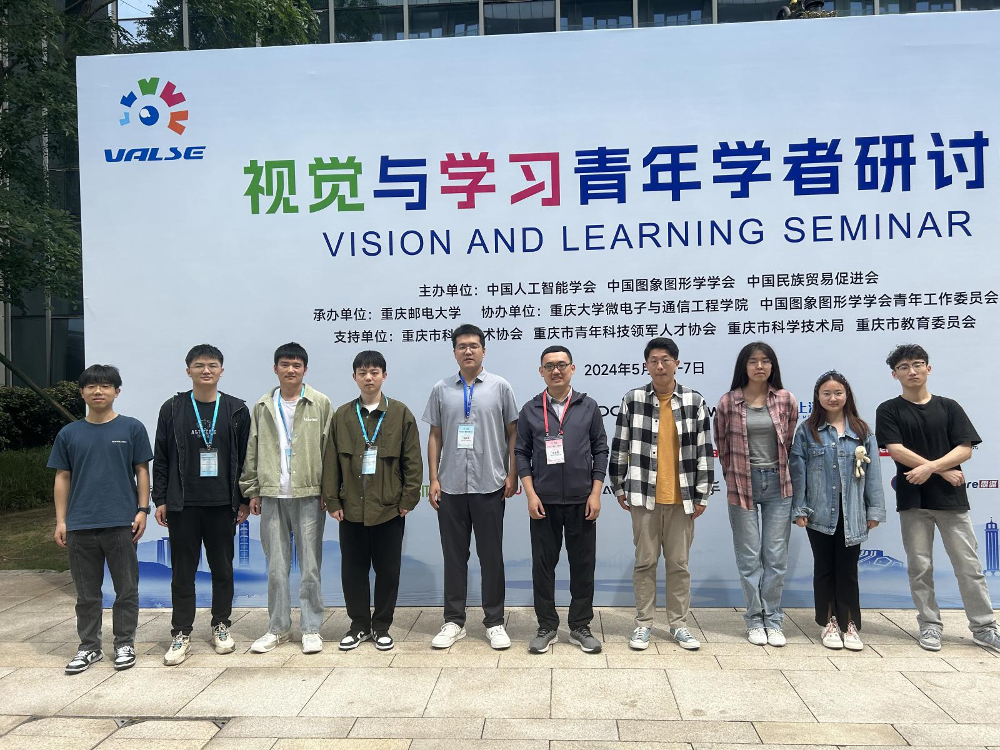
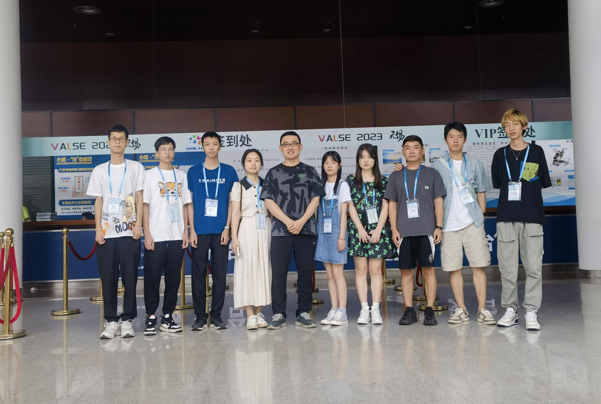
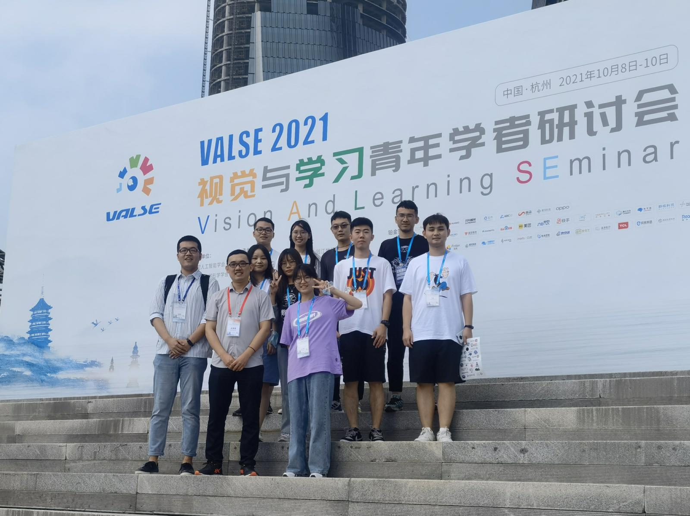

### Academic Advisors

[Xinbo Gao (高新波)](https://see.xidian.edu.cn/faculty/xbgao/){:target="_blank"}

[Ruimin Hu (胡瑞敏)](https://web.xidian.edu.cn/rmhu/index.html){:target="_blank"}

[Nannan Wang (王楠楠)](https://web.xidian.edu.cn/nnwang/){:target="_blank"}

***
### Ph.D. Students 

Jiuyao Jing (荆久耀) 
2025s-

Jinyong Chen (陈金永) 
2025f-

***
### Master Students

Rong Sheng (盛荣) 
2023-2026

Yupeng Lai (赖玉鹏) 
2023-2026

Tianzhe Yan (严添喆) 
2023-2026

Youdong Luo (罗友东) 
2023-2026

Zhou Zhou (周洲) 
2023-2026

Zhuang Tang (汤壮) 
2023-2026

Hongyu Deng (邓宏宇) 
2023-2026

Xinyi Wang (王心怡) 
2023-2026

Tian Xu (许恬) 
2024-2027

Siyue Zhou (周思乐) 
2024-2027

Lingpeng Mou (牟灵朋) 
2024-2027

Yujie Yao (姚宇杰) 
2024-2027

Runxian Wang (王润贤) 
2024-2027

Zhengxuan Zhang (张正瑄) 
2024-2027

Xiaodi Duan (段晓迪) 
2024-2027

Junye Li (李俊烨) 
2025-2028

Yinyin Chen (陈茵茵) 
2025-2028

Chengrui Hao (郝程瑞) 
2025-2028

Hengji Miao (缪恒基) 
2025-2028

Yuanqiao Tang (汤远桥) 
2025-2028

Linjing Xing (邢琳婧) 
2025-2028

Heng Zhang (张恒) 
2026-2029

Qifei Chen (陈芑霏) 
2026-2029

***
***
### Alumni

Yukai Wang (王昱凯) 
2020-2023, 事业单位（广东）

Siyuan Zhao (赵思源) 
2020-2023, 陕西电信（西安）

Congyu Zhang (张丛钰) 
2020-2024, 科大讯飞（合肥）

Shuang Wan (万爽) 
2021-2024, 腾讯（深圳）

Zimo Kong (孔子墨) 
2021-22024, 浙商银行（西安）

Bo Wang (王博) 
2021-22024, 事业单位（广东）

Qun Guan (管群) 
2021-22024, 事业单位（广东）

Zimin Miao (苗紫民) 
2021-22024, 华为（上海）

Zhan Dang (党展) 
2021-22024, 华为（上海）

Xiaoyi Luo (罗肖怡) 
2022-22025, 中国人寿（上海）

Feiyang Sun (孙飞洋) 
2022-2025, 事业单位（济南）

Huiqing Guo (郭荟青) 
2022-2025, 字节跳动（上海）

Tao Chen (陈涛) 
2022-2025, 中控技术（杭州）

Xu Luo (罗旭) 
2022-2025, 金山（武汉）

Weizhao Yang (杨炜钊) 
2022-2025, 拼多多（上海）

Boyu Wang (王博煜) 
2022-2025， 事业单位（广州）

Yuhang Yang (杨雨航) 
2022-2025, 网易（杭州）

***

  

Zhuhai, 2025.05.
 

  

Chongqing, 2024.05
 

  

Wuxi, 2023.06
 

  

 
Hangzhou, 2021.10

